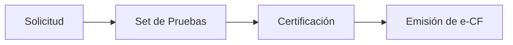

# Factura Electrónica en República Dominicana

## Guía Completa del Sistema de Comprobantes Fiscales Electrónicos (e-CF)

---

## 1. Introducción

La **factura electrónica** en República Dominicana, conocida oficialmente como **Comprobante Fiscal Electrónico (e-CF)**, es un documento digital que certifica la transferencia de bienes, la entrega en uso o la prestación de servicios entre partes comerciales. Este sistema reemplaza las facturas tradicionales en papel y está regulado por la **Dirección General de Impuestos Internos (DGII)**.

### 1.1 Marco Legal

El sistema de facturación electrónica se rige por:

- **Ley No. 32-23** de Facturación Electrónica (promulgada en 2023)
- **Decreto 587-24** - Reglamento de aplicación de la Ley 32-23
- Normativas y resoluciones emitidas por la DGII

### 1.2 Objetivos del Sistema

| Objetivo           | Descripción                                              |
| ------------------ | -------------------------------------------------------- |
| **Modernización**  | Digitalizar los procesos de facturación y control fiscal |
| **Transparencia**  | Aumentar la visibilidad en las transacciones comerciales |
| **Eficiencia**     | Mejorar la recaudación tributaria y reducir la evasión   |
| **Simplificación** | Facilitar el cumplimiento tributario para contribuyentes |

---

## 2. Tipos de Comprobantes Fiscales Electrónicos

La DGII ha establecido diversos tipos de e-CF, cada uno con una función específica:

### 2.1 Comprobantes Principales

| Tipo                                      | Código | Descripción                        | Uso Principal                                          |
| ----------------------------------------- | ------ | ---------------------------------- | ------------------------------------------------------ |
| **Factura de Crédito Fiscal Electrónica** | E31    | Transacciones entre empresas (B2B) | Sustentar gastos, costos o crédito fiscal              |
| **Factura de Consumo Electrónica**        | E32    | Ventas a consumidores finales      | Transferencia de bienes o servicios a personas físicas |
| **Nota de Débito Electrónica**            | E33    | Recuperar costos adicionales       | Intereses por mora, fletes, recargos post-factura      |
| **Nota de Crédito Electrónica**           | E34    | Modificar condiciones de venta     | Anulaciones, devoluciones, descuentos, correcciones    |

### 2.2 Comprobantes Especiales

| Tipo                                      | Código | Descripción                                               |
| ----------------------------------------- | ------ | --------------------------------------------------------- |
| **Comprobante Electrónico de Compras**    | E41    | Compras a personas no registradas como contribuyentes     |
| **Comprobante para Gastos Menores**       | E43    | Pagos por personal relacionados con actividades laborales |
| **Comprobante para Regímenes Especiales** | E44    | Transacciones bajo regímenes fiscales especiales          |
| **Comprobante Gubernamental**             | E45    | Transacciones con entidades gubernamentales               |
| **Comprobante de Exportaciones**          | E46    | Ventas de bienes fuera del territorio nacional            |
| **Comprobante para Pagos al Exterior**    | E47    | Pagos a entidades internacionales                         |

---

## 3. Estructura del e-NCF

El **Número de Comprobante Fiscal Electrónico (e-NCF)** es una secuencia alfanumérica única de **13 caracteres**:

```
E 31 0000012345
│ ││ └──────────── Número secuencial (10 dígitos)
│ └┴──────────────── Tipo de comprobante (2 dígitos)
└─────────────────── Letra "E" (Serie electrónica)
```

### 3.1 Ejemplos de e-NCF

| e-NCF           | Tipo de Comprobante          |
| --------------- | ---------------------------- |
| `E310000000001` | Factura de Crédito Fiscal #1 |
| `E320000000001` | Factura de Consumo #1        |
| `E340000000001` | Nota de Crédito #1           |
| `E410000000001` | Comprobante de Compras #1    |

---

## 4. Requisitos para Ser Emisor Electrónico

Para poder emitir e-CF, los contribuyentes deben cumplir con los siguientes requisitos:

### 4.1 Requisitos Básicos

1. ✅ Estar inscrito en el **Registro Nacional de Contribuyentes (RNC)**
2. ✅ Estar **al día** con obligaciones tributarias y deberes formales
3. ✅ Poseer **autorización para emitir Comprobantes Fiscales** (Alta NCF)
4. ✅ Tener acceso a la **Oficina Virtual (OFV)** de la DGII
5. ✅ Contar con un **certificado digital válido** emitido por una prestadora de servicios de confianza
6. ✅ Disponer de **software para emisión de e-CF** o utilizar un proveedor certificado
7. ✅ Aprobar el **proceso de certificación** de la DGII

### 4.2 Certificado Digital

> [!IMPORTANT]
> El certificado digital es **obligatorio** para firmar electrónicamente los e-CF. Debe ser emitido por una entidad certificadora autorizada en República Dominicana.

---

## 5. Proceso de Certificación

El proceso para convertirse en emisor electrónico consta de tres etapas:



### 5.1 Etapa 1: Solicitud

1. Completar el **Formulario FI-GDF-016** (Solicitud para ser Emisor Electrónico)
2. Enviar a través de la Oficina Virtual (OFV) o presencialmente
3. La DGII valida el cumplimiento de requisitos
4. Se envía enlace al portal de certificación con credenciales

### 5.2 Etapa 2: Set de Pruebas

En esta etapa se verifica la capacidad técnica del software:

| Tipo de Prueba              | Descripción                                |
| --------------------------- | ------------------------------------------ |
| **Pruebas de Datos**        | Validación de estructura y campos del XML  |
| **Pruebas de Simulación**   | Emisión de e-CF en ambiente de pruebas     |
| **Pruebas de Comunicación** | Envío y recepción con Web Services de DGII |
| **Representación Impresa**  | Generación de RI conforme a normativa      |

### 5.3 Etapa 3: Certificación Final

1. Completar exitosamente todas las pruebas
2. Presentar declaración jurada
3. Recibir autorización de la DGII
4. Se habilita menú de Facturación Electrónica en OFV
5. Solicitar e-NCF y comenzar emisión

---

## 6. Calendario de Implementación Obligatoria

La obligatoriedad se ha establecido de forma **progresiva** según el tipo de contribuyente:

| Tipo de Contribuyente                 | Fecha Límite        | Estado        |
| ------------------------------------- | ------------------- | ------------- |
| **Grandes Contribuyentes Nacionales** | 15 mayo 2024        | ✅ Completado |
| **Grandes Contribuyentes Locales**    | 15 noviembre 2025\* | 🔄 En proceso |
| **Medianos Contribuyentes**           | 15 noviembre 2025\* | 🔄 En proceso |
| **Pequeños Contribuyentes**           | 15 mayo 2026        | ⏳ Pendiente  |
| **Micro y No Clasificados**           | 15 mayo 2026        | ⏳ Pendiente  |

> [!NOTE]
> \*La DGII otorgó prórroga de 6 meses (de mayo a noviembre 2025) para contribuyentes que ya estén en proceso de adopción.

---

## 7. Especificaciones Técnicas

### 7.1 Formato XML

Los e-CF utilizan el formato **XML (eXtensible Markup Language)** estandarizado por la DGII.

#### Estructura Principal del XML

```xml
<?xml version="1.0" encoding="UTF-8"?>
<ECF xmlns="https://dgii.gov.do/ecf">
  <Encabezado>
    <Version>1.0</Version>
    <IdDoc>
      <TipoeCF>31</TipoeCF>
      <eNCF>E310000000001</eNCF>
      <FechaVencimientoSecuencia>2025-12-31</FechaVencimientoSecuencia>
    </IdDoc>
    <Emisor>
      <RNCEmisor>101123456</RNCEmisor>
      <RazonSocialEmisor>EMPRESA EJEMPLO SRL</RazonSocialEmisor>
      <!-- Más campos del emisor -->
    </Emisor>
    <Comprador>
      <RNCComprador>101789456</RNCComprador>
      <RazonSocialComprador>CLIENTE EJEMPLO SA</RazonSocialComprador>
      <!-- Más campos del comprador -->
    </Comprador>
    <Totales>
      <MontoGravadoTotal>10000.00</MontoGravadoTotal>
      <MontoGravadoI1>10000.00</MontoGravadoI1>
      <TotalITBIS>1800.00</TotalITBIS>
      <TotalITBIS1>1800.00</TotalITBIS1>
      <MontoTotal>11800.00</MontoTotal>
    </Totales>
  </Encabezado>
  <DetallesItems>
    <Item>
      <NumeroLinea>1</NumeroLinea>
      <NombreItem>Servicio de Consultoría</NombreItem>
      <IndicadorFacturacion>1</IndicadorFacturacion>
      <CantidadItem>1</CantidadItem>
      <PrecioUnitarioItem>10000.00</PrecioUnitarioItem>
      <MontoItem>10000.00</MontoItem>
    </Item>
  </DetallesItems>
  <Signature>
    <!-- Firma Digital -->
  </Signature>
</ECF>
```

### 7.2 Firma Digital

> [!CAUTION]
> Todo e-CF **debe** estar firmado digitalmente con un certificado autorizado. Documentos sin firma válida serán rechazados.

La firma digital garantiza:

- **Autenticidad**: Confirma la identidad del emisor
- **Integridad**: Asegura que el documento no ha sido modificado
- **No repudio**: El emisor no puede negar haber emitido el documento

### 7.3 Web Services de la DGII

La comunicación con la DGII se realiza mediante servicios web:

| Servicio                 | Función                                     |
| ------------------------ | ------------------------------------------- |
| **Recepción**            | Envío de e-CF para validación               |
| **Consulta Estado**      | Verificar estado de e-CF enviados           |
| **Acuse de Recibo**      | Confirmación de recepción                   |
| **Aprobación Comercial** | Aceptación o rechazo por parte del receptor |
| **Anulación**            | Cancelación de e-CF emitidos                |

### 7.4 Validación en Tiempo Real

Al momento de emisión, la DGII valida:

- ✓ Cumplimiento del esquema XML
- ✓ Consistencia de datos
- ✓ Validez de la firma digital
- ✓ Secuencia del e-NCF
- ✓ Cumplimiento de normativas tributarias

La respuesta de validación es **casi instantánea**.

---

## 8. Facturador Gratuito de la DGII

La DGII ofrece un **Facturador Gratuito** para contribuyentes que cumplan:

### 8.1 Condiciones de Elegibilidad

- Emitir hasta **150 facturas mensuales**
- Estar al día con obligaciones tributarias
- No requerir integraciones complejas

### 8.2 Características

| Característica           | Disponible |
| ------------------------ | ---------- |
| Emisión de e-CF básicos  | ✅         |
| Firma digital automática | ✅         |
| Envío directo a DGII     | ✅         |
| Representación Impresa   | ✅         |
| Integraciones API        | ❌         |
| Volumen alto de facturas | ❌         |

---

## 9. Sanciones por Incumplimiento

> [!WARNING]
> El incumplimiento de la Ley de Facturación Electrónica puede acarrear sanciones significativas.

### 9.1 Tipos de Sanciones

- **Multas pecuniarias** por no implementar en plazos establecidos
- **Penalizaciones adicionales** por reincidencia
- **Invalidez fiscal**: Las facturas emitidas fuera del sistema electrónico **no tendrán validez fiscal** después de la fecha límite

### 9.2 Consecuencias para Compradores

- No podrán sustentar gastos o costos con facturas no electrónicas
- Pérdida de crédito fiscal por ITBIS

---

## 10. Beneficios de la Facturación Electrónica

### Para Empresas

| Beneficio               | Descripción                                             |
| ----------------------- | ------------------------------------------------------- |
| 💰 **Ahorro de costos** | Eliminación de impresión, almacenamiento físico y envío |
| ⚡ **Agilidad**         | Emisión y recepción instantánea                         |
| 🔒 **Seguridad**        | Documentos firmados digitalmente, no falsificables      |
| 📊 **Mejor control**    | Reportes automáticos y trazabilidad completa            |
| 🌱 **Sostenibilidad**   | Reducción del uso de papel                              |

### Para la Administración Tributaria

- Mayor control fiscal en tiempo real
- Reducción de la evasión tributaria
- Datos estadísticos más precisos
- Facilitación de auditorías

---

## 11. Recursos y Enlaces Útiles

### Sitios Oficiales

- **Portal de Facturación Electrónica DGII**: [dgii.gov.do/eFactura](https://dgii.gov.do)
- **Oficina Virtual DGII**: [ofv.dgii.gov.do](https://ofv.dgii.gov.do)
- **Centro de Documentación**: Especificaciones técnicas y esquemas XML

### Documentos Importantes

- Ley 32-23 de Facturación Electrónica
- Decreto 587-24 (Reglamento)
- Manual Técnico del e-CF
- Esquemas XSD para validación

---

## 12. Preguntas Frecuentes (FAQ)

### ¿Puedo seguir emitiendo facturas en papel?

Depende de su clasificación como contribuyente y la fecha límite asignada. Después de su fecha límite, **solo serán válidas las facturas electrónicas**.

### ¿Necesito cambiar mi sistema de facturación?

Si su sistema actual no soporta e-CF, deberá:

- Actualizarlo para cumplir con las especificaciones de la DGII
- Contratar un proveedor de servicios certificado
- Utilizar el Facturador Gratuito de la DGII (si califica)

### ¿Qué pasa si mi cliente no es emisor electrónico?

Puede emitir e-CF a cualquier contribuyente registrado en el RNC. El receptor recibirá el documento y puede consultarlo en la Oficina Virtual de la DGII.

### ¿Cuánto tiempo debo conservar los e-CF?

Los e-CF deben conservarse por el período establecido en el Código Tributario (generalmente **10 años**).

---

_Documento actualizado: Diciembre 2024_

_Fuentes: DGII, Ley 32-23, Decreto 587-24_
